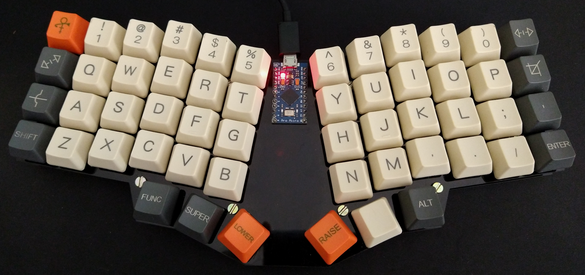

# 🦇 Bat Keeb

Firmware of my new keyboard :D

## Objectives

* Improve upon my last project, the [Ghetto Keyboard][1]. A merged photo
  gallery of all my keyboards experiments can be found [here][2].
* Understand the AVR architecture and how Arduino library works. I removed the
  Arduino IDE dependency and made a Makefile that compiles and burn the
  firmware on the Pro Micro using only avr-gcc and avrdude. For now, all the
  Arduino library and the Keyboard library are imported into the project, but I
  plan on reducing them to the bare minimum for my keyboard to work.

[1]: https://github.com/ianliu/tabua-keyboard
[2]: https://photos.app.goo.gl/t2CV9Ba2a8GsdRCAA
